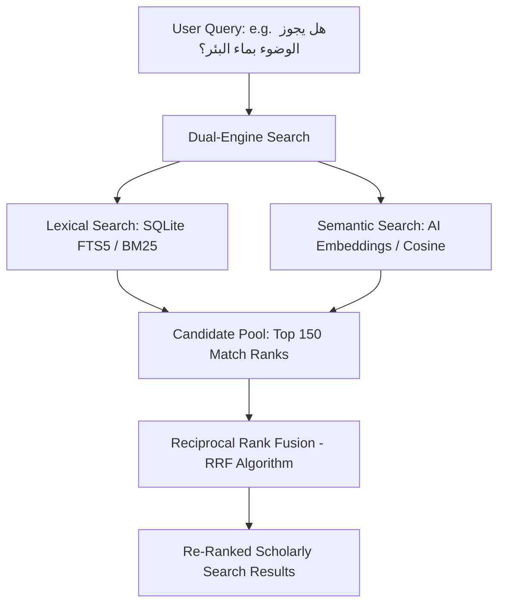

# 📖 Fiqh.ai — Premium Scholarly Search & AI Reference Engine

Fiqh.ai is a state-of-the-art, citation-safe, hybrid search and reference engine designed specifically for the deep study and academic investigation of classical **Hanafi Fiqh** texts. 

By merging traditional manuscript ergonomics with modern semantic AI, Fiqh.ai helps researchers, jurists, and students of Islamic law instantly retrieve exact legal rulings, complete page contexts, and verified bibliographical citations.

---

## 🚀 The Core Philosophy: "Citation Safety First"
Traditional LLM chatbots (like ChatGPT) are notorious for **hallucinations**—inventing non-existent books, fabrication of authors, and scrambling page numbers. In Islamic jurisprudence (Fiqh), this is unacceptable.

Fiqh.ai solves this by using a strict **Retrieval-Augmented Reference (RAR)** model:
1. It never generates legal rulings out of thin air.
2. It retrieves the **exact text, page, volume, and section** directly from a curated database of verified classical prints.
3. Every result is perfectly traceable and verifiable against physical prints.

---

## ⚡ The Magic: Lexical vs. Semantic vs. Hybrid Search

To deliver unmatched accuracy, Fiqh.ai employs a dual-engine architecture combined via **Reciprocal Rank Fusion (RRF)**.



### 1. Lexical Search (SQLite FTS5 / BM25)
* **What it does**: Matches the literal characters of the search query against the texts using customized orthographic normalization rules.
* **Why it's needed**: Essential for finding specific phrases, exact Quranic/Hadith citations, specific names of scholars (e.g., أبو حنيفة, أبو يوسف), or literal rulings. 
* **The limitation**: It cannot understand meaning. If you search for `بئر` (well) and a page contains `الركيّ` (classical Arabic for well), lexical search will miss it entirely.

### 2. Semantic AI Search (Sentence Transformers)
* **What it does**: Uses a deep-learning model (`asafaya/bert-base-arabic`) to translate Arabic sentences into **768-dimensional mathematical vectors**. 
* **Why it makes the difference**: It matches the **meaning and legal concepts** instead of just matching literal characters. 
* **The magic**: It understands that `بئر` and `الركيّ` are synonyms in legal contexts. Searching for well water will successfully retrieve sections using archaic terms.

### 3. Reciprocal Rank Fusion (RRF)
To get the absolute best of both worlds, Fiqh.ai blends both lexical and semantic ranks mathematically. Since lexical scores (BM25) and semantic scores (Cosine Similarity) are on completely different scales, we cannot add them directly. Instead, we use RRF:

$$\text{RRF Score}(d) = \sum_{m \in M} \frac{1}{k + r_m(d)}$$

Where:
* $M$ represents the search models (Lexical and Semantic).
* $r_m(d)$ is the rank order of document $d$ in search model $m$ (1-based index).
* $k$ is a smoothing constant (standardized to $60$).
* **Result**: Highly relevant exact matches are kept at the very top, while conceptually rich pages that share no literal keywords are seamlessly pulled into the top results.

---

## 🎨 Premium Scholarly Workbench UI

The frontend is a specialized workspace designed to replicate the feel of a physical manuscript study:

* **Split-Screen Desktop Layout**: Click `قراءة السياق` (Read Context) on any card to instantly slide in a dedicated context pane from the right side. Research side-by-side without losing your search place.
* **Dynamic Typography Controls Bar**: Scholars can toggle between classical typefaces (**Amiri**, **Noto Naskh Arabic**, or **Cairo**) and scale the reading font size (`-` / `+`) dynamically to reduce eye strain.
* **Multi-Format Citation Dropdown**: Copy exact academic citations in three standard templates with a single click:
  - **Chicago Style**: Perfect for academic papers.
  - **Markdown Format**: Pre-styled for personal study wikis, Obsidian, and Notion.
  - **Plain Text**: Optimized for sharing on messaging applications.
* **Arabic-Aware Text-to-Speech (TTS)**: Built a smart TTS synthesizer that dynamically strips complex diacritics/tashkeel and parenthetical statements from the classical page so the browser reads the text aloud in a fluent, natural Arabic voice.

---

## 🛠️ The Tech Stack

### Frontend (apps/web)
* **Framework**: Next.js 16.0 (Turbopack) & React 19
* **Styling**: Premium Vanilla CSS (Harmonious **Parchment**, **Night**, and **Emerald** theme tokens)
* **Hosting**: Vercel

### Backend (apps/api & Hugging Face Space)
* **Framework**: FastAPI (Python 3.9)
* **Database**: SQLite3 with WAL (Write-Ahead Logging) enabled
* **AI Model**: `asafaya/bert-base-arabic` (SentenceTransformers)
* **Hosting**: Dockerized container running on Hugging Face Spaces

---

## 🗄️ Database Architecture

The SQLite engine operates on a streamlined schema tailored for classical reference divisions:

### 1. `books`
Stores bibliographical metadata for the indexed corpus (currently indexing 7 major prints, representing over **115,500 passages**).
```sql
CREATE TABLE books (
    id INTEGER PRIMARY KEY,
    title TEXT NOT NULL,
    authors_json TEXT NOT NULL,       -- JSON array of authors
    categories_json TEXT NOT NULL,    -- Subject category tags
    publisher TEXT,
    year TEXT,
    source_file TEXT NOT NULL,
    source_format TEXT NOT NULL
);
```

### 2. `chunks`
Stores the actual textual segments mapped to their physical pagination.
```sql
CREATE TABLE chunks (
    id INTEGER PRIMARY KEY AUTOINCREMENT,
    book_id INTEGER NOT NULL REFERENCES books(id),
    book_title TEXT NOT NULL,
    authors_json TEXT NOT NULL,
    categories_json TEXT NOT NULL,
    publisher TEXT,
    year TEXT,
    part_name TEXT,                  -- Volume / Part number
    page_number INTEGER,             -- Printed Page number
    page_id INTEGER,
    breadcrumb_json TEXT NOT NULL,   -- Complete hierarchy path
    breadcrumb_text TEXT NOT NULL,   -- Full hierarchical text
    text_raw TEXT NOT NULL,          -- Raw text with Tashkeel
    text_normalized TEXT NOT NULL,   -- Tashkeel-free normalized search target
    source_file TEXT NOT NULL,
    source_line INTEGER NOT NULL
);
```

### 3. `chunk_embeddings`
Stores the precompiled AI semantic vectors (768 dimensions per passage).
```sql
CREATE TABLE chunk_embeddings (
    chunk_id INTEGER PRIMARY KEY REFERENCES chunks(id),
    embedding BLOB NOT NULL          -- Serialized float32 vector blob
);
```

---

## 💻 Local Setup & Development

### 1. Backend Ingestion & Embedding Generation
To run the backend and generate your local vector index:

```bash
# 1. Navigate to the API folder
cd apps/api

# 2. Set up virtual environment and install dependencies
python3 -m venv .venv
source .venv/bin/activate
pip install -r requirements.txt

# 3. Ingest raw books from JSONL
python3 scripts/ingest_books.py

# 4. Generate AI Vector Embeddings (uses local GPU if available!)
python3 scripts/generate_embeddings.py
```

### 2. Launching the Web Workspace
```bash
# Navigate to the root directory
cd ../../

# Install dependencies and start Turbopack development server
npm install
npm run dev:web
```
Open `http://localhost:3000` to interact with your local scholarly workspace!

---

## 🏆 Credits
Created and engineered with dedication to the preservation and accessibility of Islamic jurisprudence by **Mohammad Usman**. 
* **Portfolio**: [Mohammad Usman Portfolio](https://portfolio-mohammad.web.app/yameen)
